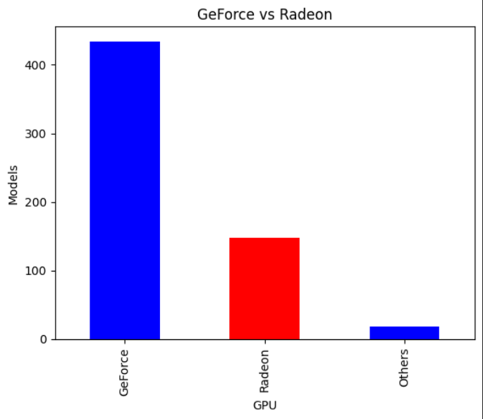

# GPU Scraper for Morele.net 🔍

This web scraping application is designed to help users find the best available GPU on Morele.net.

## Project Overview
- **Objective**: To extract GPU information from Morele.net efficiently.
- **Technology Stack**: Python, Beautiful Soup, Pandas, Matplotlib

## Future Considerations 🛠

The nature of web scraping means that the application will need periodic updates. This is due to the potential changes in the HTML structure of Morele.net website over time. As such, it's essential to monitor the application to ensure consistent data accuracy.

## Data Result

